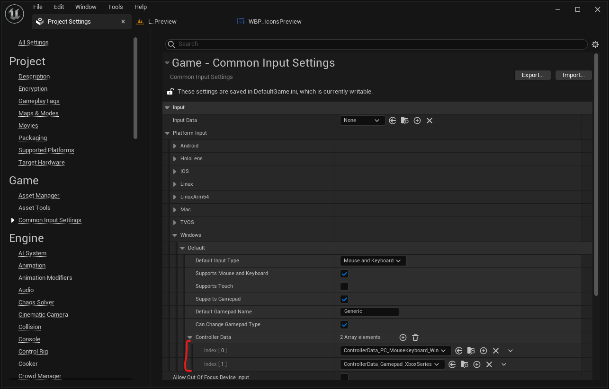

# Input Devices Brushes

Tired of recreating over and over again databases with UI brushes representing various input devices buttons?

Well, this plugin might be for you!

This content-only plugin contains a set of UCommonInputBaseControllerData databases that can be used to retrive data of input devices buttons UI images. It is completely based on built-in Unreal [CommonUI](https://docs.unrealengine.com/5.0/en-US/common-ui-plugin-for-advanced-user-interfaces-in-unreal-engine/) plugin - no need to install third-party items.

Right now it contains only a fraction of controller types (most popular/recent ones: Mouse&Keyboard, Xbox Series and PS5), but this list might be updated in nearest future.

---
## Kudos to Xelu
Majority of icons used for input devices buttons images have been created by Xelu's from ThoseAwesomeGuys and shared in public domain - CCO (they can be download from this site: https://thoseawesomeguys.com/prompts/).

I just want to thank you Xelu for your great work and kindness!

---
## License
This plugin with all its content is licensed under the [MIT](https://choosealicense.com/licenses/mit/) & [Apache 2.0](https://www.apache.org/licenses/LICENSE-2.0) Licenses.

---
## Support
In case of any questions you can contact me at sosnowska.kk@gmail.com.

---
## Installation and usage
In order to install this plugin, you need to copy-paste InputDevicesBrushes folder inside your project's *Plugins* folder. Then, make sure you've enabled this plugin in your project.

One more thing to do is to use provided sets of brushes in *Project Settings*. Navigate to **Game - Common Input Settings / Input / Platform Input** and fill **Controller Data** for selected Platform with set of brushes of your choice.

Keep in mind that this plugin requires Unreal's CommonUI plugin enabled in you project, so you need to have compatible engine version installed. I've tested it only in Unreal 5.1.